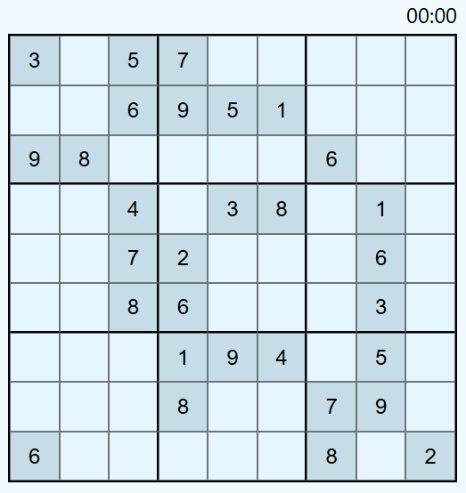

# 🧩 Sudoku Web

<div align="center">
    Um jogo de Sudoku clássico, desenvolvido com <strong>HTML</strong>, <strong>CSS</strong> e <strong>JavaScript Puro</strong>.
    <br><br>
    🔗 <strong><a href="https://davi-2002.github.io/Sudoku-Web/">Jogue Agora (Live Demo)</a></strong> 
</div>

<br>
<div align="center">
  
</div>

## 🚀 Funcionalidades

- **Geração Aleatória:** Um novo tabuleiro é gerado a cada recarregamento, garantindo que nenhum jogo seja igual ao outro.
- **Validação de Regras:** O sistema verifica em tempo real se a jogada é válida (números não podem se repetir na mesma linha, coluna ou quadrante 3x3).
- **Design Responsivo:** Interface adaptável que funciona perfeitamente em Desktops e Dispositivos Móveis (utilizando CSS Grid e Flexbox).
- **Timer:** Cronômetro integrado para desafiar a velocidade do jogador.
- **Interface Intuitiva:** Inputs validados para aceitar apenas números de 1 a 9, com substituição automática para melhor experiência de uso (UX).

## 🛠️ Tecnologias Utilizadas

- **HTML:** Estrutura semântica do projeto.
- **CSS:** Estilização moderna, uso de variáveis (CSS Variables) e Grid Layout.
- **JavaScript (ES6+):** Lógica completa do jogo, manipulação do DOM, algoritmos de validação e geração de matrizes.

## 📂 Como rodar localmente

1. Clone o repositório:
   ```bash
   git clone https://github.com/Davi-2002/Sudoku-Web.git

2. Abra o arquivo index.html no seu navegador preferido.
